# Irrigation Detection Algorithm Documentation

**Last Updated:** 2026-01-02  
**Version:** 2.0 (Drop-Based Detection)

---

## 📋 Overview

This algorithm detects irrigation events from water level charts and extracts the **first irrigation start time** and **last irrigation end time** for each date.

---

## 🎯 Core Concept

**Key Insight:** Irrigation causes water level to DROP, which appears as Y-value INCREASING in SVG coordinates.

```
Water Level Chart (Visual):
High ┌──┐         ┌──┐
     │  └────┐ ┌──┘  │
Low  │       └─┘     │
     ↑   ↑   ↑   ↑   ↑
    START        END
```

---

## 🔄 Algorithm Flow


---

## 📊 Detailed Steps

### **Step 1: Smooth Data**
```javascript
// Reduce noise by averaging over 3-point window
for each point i:
  smoothedY[i] = average(Y[i-3] to Y[i+3])
```

### **Step 2: Detect Drops**
```javascript
// Find where water level drops significantly
for each point i:
  avgBefore = average(smoothedY[i-10 to i])
  avgAfter = average(smoothedY[i to i+10])
  
  dropAmount = avgAfter - avgBefore  // Higher Y = lower water
  dropPercent = (dropAmount / yRange) * 100
  
  if (dropPercent ≥ 8%):
    drops.push(point)
```

### **Step 3: De-duplicate**
```javascript
// Merge drops within 10% of chart width (same irrigation event)
for each drop:
  if any existing drop within 10% X-distance:
    keep the one with bigger drop amount
  else:
    add as new unique drop
```

### **Step 4: Find START & END**
```javascript
for each unique drop:
  // Find START (before drop)
  Look backward 20 points
  START = point with highest water level (lowest Y)
  
  // Find END (after recovery)
  Look forward 30 points
  END = point with highest water level (lowest Y)
  
  irrigationEvents.push({start, end})
```

### **Step 5: Select Points for Tables**
```javascript
// FIRST table = START of first irrigation
firstPoint = irrigationEvents[0].start

// LAST table = END of last irrigation
lastPoint = irrigationEvents[last].end

// These are ALWAYS different - no duplication!
```

---

## 🎨 Visual Examples

### **Single Irrigation Event**

```mermaid
graph LR
    A[08:00<br/>HIGH WATER<br/>★ FIRST] -->|Drop starts| B[10:00<br/>LOW WATER<br/>Irrigation]
    B -->|Recovery| C[12:00<br/>HIGH WATER<br/>★ LAST]
    
    style A fill:#90EE90
    style C fill:#FFB6C1
```


**Result:**
- **First irrigation time:** 08:00 (START)
- **Last irrigation time:** 12:00 (END)

---

### **Multiple Irrigation Events**

```mermaid
graph LR
    A[08:00<br/>HIGH<br/>★ FIRST] -->|Drop 1| B[10:00<br/>LOW<br/>Irrigation 1]
    B -->|Recover| C[12:00<br/>HIGH]
    C -->|Drop 2| D[15:00<br/>LOW<br/>Irrigation 2]
    D -->|Recover| E[17:00<br/>HIGH<br/>★ LAST]
    
    style A fill:#90EE90
    style E fill:#FFB6C1
```


**Result:**
- **First irrigation time:** 08:00 (START of first)
- **Last irrigation time:** 17:00 (END of last)

---

## 🔧 Configuration Parameters

| Parameter | Value | Purpose |
|-----------|-------|---------|
| Smooth Window | 3 points | Noise reduction |
| Drop Threshold | 8% of Y-range | Minimum drop to detect irrigation |
| Lookback (START) | 20 points | How far to search before drop |
| Lookforward (END) | 30 points | How far to search after drop |
| De-duplication | 10% X-span | Merge nearby drops |
| Click Offset Y | 15px above | Highcharts clickable area |

---

## ✅ Validation Rules

### **Drop Validation**
- Must be ≥8% of total Y-range
- avgAfter must be > avgBefore (water level dropped)

### **START Validation**
- Must be BEFORE the drop (index < dropIndex)
- Must be at high water level

### **END Validation**
- Must be AFTER the drop (index > dropIndex)
- Must be at recovered water level

---

## 📈 Expected Behavior

### **✅ Should Detect**
- Clear irrigation events with significant drops
- Single irrigation per day
- Multiple irrigations per day
- Short irrigations (few hours)
- Long irrigations (many hours)

### **⚠️ May Skip**
- Very small drops (<8% of range) - likely noise
- Charts with no irrigation data
- Dates where tables already filled

### **❌ Should NOT Detect**
- Random noise or fluctuations
- Data gaps or errors in chart
- Non-irrigation water level changes

---

## 🐛 Troubleshooting

### **Problem: No drops detected**
**Causes:**
- Chart has no irrigation data for this date
- Drop threshold too high (8%)
- Smoothing window too large

**Solutions:**
- Check if chart shows any visual drops
- Lower threshold to 6-7%
- Reduce smooth window to 2

---

### **Problem: Too many false positives**
**Causes:**
- Drop threshold too low
- Noise in chart data
- Smooth window too small

**Solutions:**
- Increase threshold to 10%
- Increase smooth window to 5
- Improve de-duplication distance to 15%

---

### **Problem: First = Last (duplicates)**
**Causes:**
- Algorithm not finding END point correctly
- Only one irrigation but using START for both

**Fix:**
- ✅ **FIXED in v2.0:** Now always uses START for first, END for last
- No more duplication logic

---

## 📝 Version History

### **v2.0 (2026-01-02)** - Current
- ✅ Changed from peak detection to drop detection
- ✅ Find both START and END for each irrigation
- ✅ FIRST = START of first irrigation
- ✅ LAST = END of last irrigation
- ✅ Removed duplication logic
- ✅ Added recovery detection for END points
- ✅ Improved validation rules

### **v1.0 (2025-12-31)**
- Initial HSSP (Highest Slope Start Point) algorithm
- ❌ Issues: Inaccurate, sometimes detected wrong points
- ❌ Issues: First and Last could be duplicates

---

## 🔮 Future Improvements

1. **Adaptive Thresholds**: Adjust based on chart Y-range statistics
2. **Pattern Learning**: Learn from user corrections
3. **Multi-zone Support**: Handle multiple irrigation zones per farm
4. **Time-of-day Validation**: Check if detected times are realistic
5. **Confidence Scoring**: Rate how confident the detection is

---

## 📚 References

- Playwright Mouse API: https://playwright.dev/docs/api/class-mouse
- SVG Path Parsing: https://developer.mozilla.org/en-US/docs/Web/SVG/Tutorial/Paths
- Highcharts Events: https://api.highcharts.com/highcharts/plotOptions.series.events

---

**End of Algorithm Documentation**

