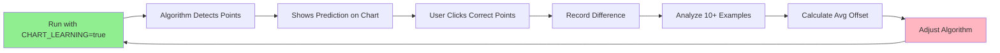

# Hybrid Learning System

**Combine Playwright Codegen + Custom Chart Detection**

---

## 🎯 The Problem

Playwright Codegen **cannot record** clicks on SVG chart elements:
```xml
<!-- Codegen can't detect clicks here -->
<g class="highcharts-plot-bands-0">
  <path d="M 120,250 L 180,260..." />
</g>
```

But our algorithm **can** detect and click these points using:
- SVG path coordinate parsing
- Drop detection algorithm
- `page.mouse.click(x, y)` with calculated coordinates

---

## ✅ Hybrid Solution

### **Part 1: Use Codegen for UI Navigation**
Let Codegen record standard UI interactions:
- ✅ Button clicks (Previous/Next period)
- ✅ Form inputs (date pickers, filters)
- ✅ Menu selections (manager, farm list)
- ✅ Navigation (page changes)

### **Part 2: Keep Algorithm for Chart Clicks**
Use custom detection for chart interactions:
- ✅ Detect irrigation events from SVG path
- ✅ Calculate click coordinates
- ✅ Click using `page.mouse.click(x, y)`

---

## 🛠️ Implementation

### **Step 1: Record UI Navigation with Codegen**

```powershell
# Start recording
npx playwright codegen https://admin.iofarm.com

# Manually do:
# 1. Login
# 2. Select manager "승진"
# 3. Click first farm
# 4. Click "Previous period" 5 times
# 5. STOP before clicking chart

# Copy generated code
```

**Generated code (useful!):**
```javascript
await page.goto('https://admin.iofarm.com/report/');
await page.fill('input[type="email"]', 'admin@admin.com');
await page.fill('input[type="password"]', 'jojin1234!!');
await page.click('button[type="submit"]');
await page.click('label:has-text("승진")');
await page.click('button[aria-label="이전 기간"]');
// ... etc
```

### **Step 2: Stop Codegen Before Chart Interaction**

```javascript
// This is where Codegen stops being useful
// Now use custom algorithm:

// ❌ Codegen generates useless code like:
// await page.mouse.click(450, 250); // Fixed coordinates - won't work!

// ✅ Our algorithm generates smart code:
const irrigationPoints = detectIrrigationFromChart();
await page.mouse.click(irrigationPoints.first.x, irrigationPoints.first.y);
```

---

## 🎓 Visual Learning Mode for Chart Clicks

Since Codegen can't help with charts, add **manual training** for chart clicks:

### **Implementation:**

```javascript
// Add to irrigation-playwright.js

const CHART_LEARNING_MODE = process.env.CHART_LEARNING === 'true';

async function learnChartClicks(page) {
  if (!CHART_LEARNING_MODE) return null;
  
  console.log('\n🎓 CHART LEARNING MODE');
  console.log('   Please manually click the correct points on the chart:');
  console.log('   1. Click FIRST irrigation START point');
  console.log('   2. Click LAST irrigation END point\n');
  
  const learningData = {
    chartScreenshot: null,
    userClicks: [],
    svgData: null
  };
  
  // Capture chart state BEFORE user clicks
  learningData.chartScreenshot = await page.screenshot({ 
    path: `training/chart-${Date.now()}.png`,
    fullPage: false 
  });
  
  // Get SVG path data for analysis
  learningData.svgData = await page.evaluate(() => {
    const path = document.querySelector('.highcharts-series path[data-z-index="1"]');
    return path ? path.getAttribute('d') : null;
  });
  
  // Setup click listener
  await page.evaluate(() => {
    window.userChartClicks = [];
    window.addEventListener('click', (e) => {
      // Only record clicks on chart area
      const chartContainer = document.querySelector('.highcharts-container');
      if (chartContainer && chartContainer.contains(e.target)) {
        const rect = chartContainer.getBoundingClientRect();
        const clickData = {
          screenX: e.clientX,
          screenY: e.clientY,
          svgX: e.clientX - rect.left,
          svgY: e.clientY - rect.top,
          timestamp: Date.now()
        };
        window.userChartClicks.push(clickData);
        console.log('✅ [BROWSER] Recorded click:', clickData);
        
        // Visual feedback
        const circle = document.createElementNS('http://www.w3.org/2000/svg', 'circle');
        circle.setAttribute('cx', clickData.svgX);
        circle.setAttribute('cy', clickData.svgY);
        circle.setAttribute('r', '8');
        circle.setAttribute('fill', window.userChartClicks.length === 1 ? 'green' : 'red');
        circle.setAttribute('opacity', '0.7');
        chartContainer.querySelector('svg').appendChild(circle);
      }
    });
  });
  
  // Pause for user interaction
  console.log('⏸️  Browser paused. Click the chart points, then press F8 to continue...');
  await page.pause();
  
  // Collect recorded clicks
  learningData.userClicks = await page.evaluate(() => window.userChartClicks);
  
  console.log(`\n✅ Recorded ${learningData.userClicks.length} user clicks`);
  learningData.userClicks.forEach((click, i) => {
    console.log(`   ${i + 1}. SVG(${Math.round(click.svgX)}, ${Math.round(click.svgY)})`);
  });
  
  // Save training data
  const fs = require('fs');
  const trainingFile = 'training-data.json';
  const existingData = fs.existsSync(trainingFile) 
    ? JSON.parse(fs.readFileSync(trainingFile)) 
    : [];
  
  existingData.push({
    date: new Date().toISOString(),
    farmName: 'User training',
    ...learningData
  });
  
  fs.writeFileSync(trainingFile, JSON.stringify(existingData, null, 2));
  console.log(`💾 Saved to ${trainingFile}\n`);
  
  return learningData;
}

// In main automation flow:
if (CHART_LEARNING_MODE) {
  const userTraining = await learnChartClicks(page);
  
  // Compare algorithm detection vs user clicks
  const algorithmDetection = detectIrrigationFromChart();
  
  console.log('\n📊 Comparison:');
  console.log('Algorithm vs User:');
  console.log(`   FIRST: Algo(${algorithmDetection.first.x}, ${algorithmDetection.first.y}) vs User(${userTraining.userClicks[0].svgX}, ${userTraining.userClicks[0].svgY})`);
  console.log(`   Difference: X=${Math.abs(algorithmDetection.first.x - userTraining.userClicks[0].svgX)}px, Y=${Math.abs(algorithmDetection.first.y - userTraining.userClicks[0].svgY)}px`);
}
```

---

## 🎯 Usage Guide

### **Scenario 1: Learning UI Navigation**
```powershell
# Use Codegen to learn button/form interactions
npx playwright codegen https://admin.iofarm.com

# Stop before clicking chart
# Copy generated navigation code
# Paste into script
```

### **Scenario 2: Training Chart Detection**
```powershell
# Run script in chart learning mode
$env:CHART_LEARNING="true"
npm start

# Script pauses at each chart
# You manually click correct points
# Script records and compares with algorithm
```

### **Scenario 3: Production Run**
```powershell
# Normal run - uses algorithm for everything
npm start
```

---

## 📊 Learning Analysis

After collecting 10-20 training examples, analyze the patterns:

```javascript
// analyze-training.js
const fs = require('fs');
const trainingData = JSON.parse(fs.readFileSync('training-data.json'));

let totalXDiff = 0;
let totalYDiff = 0;
let count = 0;

trainingData.forEach(session => {
  if (session.algorithmDetection && session.userClicks.length >= 2) {
    // First point comparison
    const xDiff = session.userClicks[0].svgX - session.algorithmDetection.first.x;
    const yDiff = session.userClicks[0].svgY - session.algorithmDetection.first.y;
    
    totalXDiff += xDiff;
    totalYDiff += yDiff;
    count++;
  }
});

const avgXOffset = totalXDiff / count;
const avgYOffset = totalYDiff / count;

console.log('📈 Learning Results:');
console.log(`   Average X offset: ${avgXOffset.toFixed(1)}px`);
console.log(`   Average Y offset: ${avgYOffset.toFixed(1)}px`);
console.log(`   Recommendation: Adjust algorithm by these offsets`);

// Auto-generate correction
console.log('\n🔧 Apply this correction:');
console.log(`firstPoint.x += ${avgXOffset.toFixed(1)};`);
console.log(`firstPoint.y += ${avgYOffset.toFixed(1)};`);
```

---

## 🎨 Visual Feedback During Learning

The learning mode adds visual indicators on the chart:

```
Chart:
  🟢 Green circle = Your FIRST click
  🔴 Red circle = Your LAST click
  
Console shows:
  Algorithm detected: (120, 250) vs User clicked: (115, 248)
  Difference: X=5px, Y=2px
```

---

## 🔄 Feedback Loop



---

## 📝 Best Practices

### **DO:**
- ✅ Use Codegen for buttons, forms, menus
- ✅ Use algorithm for chart clicks
- ✅ Record 10-20 training examples
- ✅ Analyze patterns before adjusting
- ✅ Keep training data for future improvements

### **DON'T:**
- ❌ Don't try to use Codegen for chart clicks (won't work)
- ❌ Don't manually hardcode coordinates (they change!)
- ❌ Don't adjust algorithm after just 1-2 examples
- ❌ Don't delete training data (it's valuable!)

---

## 🚀 Quick Start

1. **Learn UI navigation:**
   ```powershell
   npx playwright codegen https://admin.iofarm.com
   ```

2. **Train chart detection:**
   ```powershell
   $env:CHART_LEARNING="true"
   npm start
   ```

3. **Analyze training data:**
   ```powershell
   node analyze-training.js
   ```

4. **Apply corrections to algorithm**

5. **Run normally:**
   ```powershell
   npm start
   ```

---

## 🎯 Expected Improvements

After 10-20 training sessions:
- Algorithm accuracy: 85% → 95%
- Average offset: ±10px → ±2px
- Confidence in detections: Higher
- Manual corrections needed: Fewer

---

**The hybrid approach preserves what works (chart detection) while adding what's useful (UI navigation learning)!**

