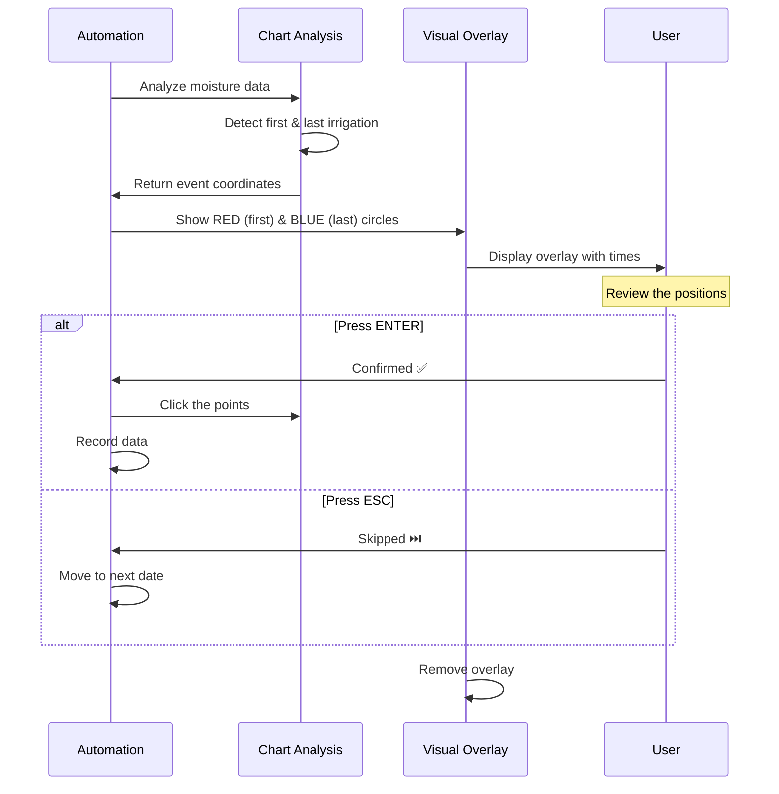

# Visual Confirmation Mode Guide

## Overview

The Visual Confirmation Mode allows you to **review and approve** each irrigation point detection **before** the automation clicks them. This prevents incorrect detections from being recorded and gives you full control over the automation accuracy.

## How It Works



## Visual Elements

### What You'll See

When the system detects irrigation events, it will pause and show:

1. **🔴 RED Pulsing Circle** - FIRST irrigation point (start of first event)
2. **🔵 BLUE Pulsing Circle** - LAST irrigation point (peak of last event)
3. **Info Box** (top-right corner) showing:
   - Times for both points (e.g., "08:30", "15:45")
   - Keyboard instructions
   - Current detection details

### Example

```
┌─────────────────────────────────────┐
│ 👁️ Visual Confirmation Mode        │
│                                     │
│ 🔴 FIRST: 08:30 (123, 456)         │
│ 🔵 LAST: 15:45 (789, 234)          │
│ ─────────────────────────────────  │
│ ✅ Press ENTER to confirm clicks   │
│ ⏭️ Press ESC to skip this date     │
└─────────────────────────────────────┘
```

## Keyboard Controls

| Key | Action | Result |
|-----|--------|--------|
| **ENTER** | Confirm | ✅ Automation proceeds to click the points and record data |
| **ESC** | Skip | ⏭️ Automation skips this date and moves to the next one |
| *(timeout)* | Auto-confirm | ⏱️ After 60 seconds, automatically confirms |

## Configuration

### Enable/Disable

In `irrigation-playwright.js`, line 29:

```javascript
const CONFIG = {
  // ... other settings ...
  visualConfirmationMode: true  // Set to false to disable
};
```

### Adjust Timeout

In `irrigation-playwright.js`, the `waitForUserConfirmation()` function (line 439):

```javascript
async function waitForUserConfirmation(page, timeout = 60000) {
  // Change 60000 to your preferred timeout in milliseconds
  // 60000 = 60 seconds
  // 30000 = 30 seconds
  // 120000 = 2 minutes
}
```

## Usage Scenarios

### Scenario 1: Correct Detection ✅

The system correctly identifies irrigation points:
- RED circle is at the start of the first irrigation rise
- BLUE circle is at the peak of the last irrigation curve
- **Action**: Press **ENTER** to confirm

### Scenario 2: Incorrect Detection ❌

The system made a mistake:
- Circles are in wrong positions
- Times don't match your expectations
- **Action**: Press **ESC** to skip this date

### Scenario 3: No Irrigation Today

The system detected events but you know there was no irrigation:
- **Action**: Press **ESC** to skip and avoid false data

### Scenario 4: Busy/Distracted

You're not actively watching:
- **Result**: After 60 seconds, system auto-confirms
- **Recommendation**: Review the data later in the history

## Testing the Feature

Run the test script to verify the overlay works:

```bash
node test-visual-confirmation.js
```

This will:
1. Open a browser with a sample chart
2. Display the visual overlay
3. Wait for you to press ENTER or ESC
4. Report the result

## Troubleshooting

### Overlay Doesn't Appear

**Possible causes:**
- `visualConfirmationMode` is set to `false`
- Chart coordinates couldn't be calculated
- Browser window is minimized

**Solution:**
- Check CONFIG settings
- Ensure browser is visible and maximized
- Check console logs for coordinate calculation errors

### Keyboard Not Responding

**Possible causes:**
- Browser window doesn't have focus
- Another element is capturing keyboard events

**Solution:**
- Click inside the browser window
- Make sure no input fields are focused
- Try clicking on the chart area first

### Overlay Appears Too Fast

**Possible causes:**
- System is processing dates very quickly
- Multiple dates are being skipped

**Solution:**
- This is normal behavior when no irrigation is detected
- Overlay only appears when irrigation events are found

### Circles Are in Wrong Position

**Possible causes:**
- Chart hasn't fully rendered
- Highcharts API returned incorrect coordinates
- Chart has unusual dimensions

**Solution:**
- Wait a few seconds after page load
- Check browser console for errors
- Verify chart is visible and not scrolled

## Benefits

✅ **Accuracy** - Catch false positives before they're recorded  
✅ **Control** - You decide what gets clicked and recorded  
✅ **Learning** - See exactly what the algorithm detects  
✅ **Confidence** - Build trust in the automation system  
✅ **Flexibility** - Skip problematic dates without stopping the entire run

## Advanced: Integration with Training Mode

The visual confirmation works alongside the training mode:

1. **Visual Confirmation** - Shows what the ALGORITHM detected
2. **Training Mode** - Shows what the USER corrected

Together, they help improve the system over time:
- Confirm correct detections → reinforces good algorithm behavior
- Skip incorrect detections → prevents bad data
- Manual corrections in training → teaches the algorithm

## Related Documentation

- [`IRRIGATION_RULES.md`](IRRIGATION_RULES.md) - Detection algorithm rules
- [`F8_TRAINING_GUIDE.md`](F8_TRAINING_GUIDE.md) - How to train the system
- [`DONT.md`](DONT.md) - Common mistakes to avoid
- [`QUICKSTART.md`](QUICKSTART.md) - Getting started guide

## Support

If you encounter issues with visual confirmation:

1. Check the browser console (F12) for errors
2. Review the terminal output for coordinate calculation logs
3. Try the test script: `node test-visual-confirmation.js`
4. Verify your CONFIG settings in `irrigation-playwright.js`

---

**Last Updated**: January 2026  
**Feature Status**: ✅ Active and tested
